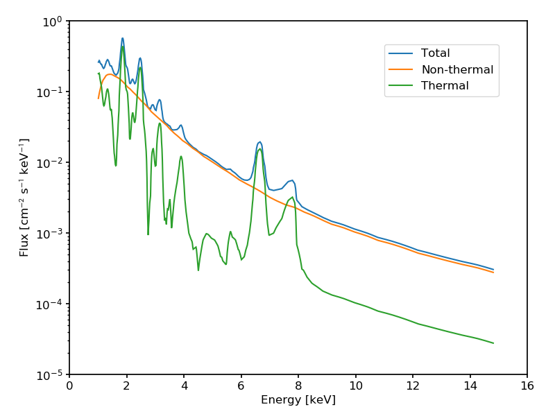
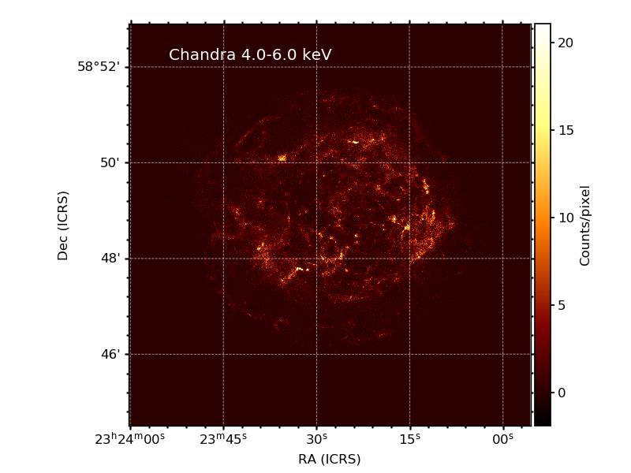
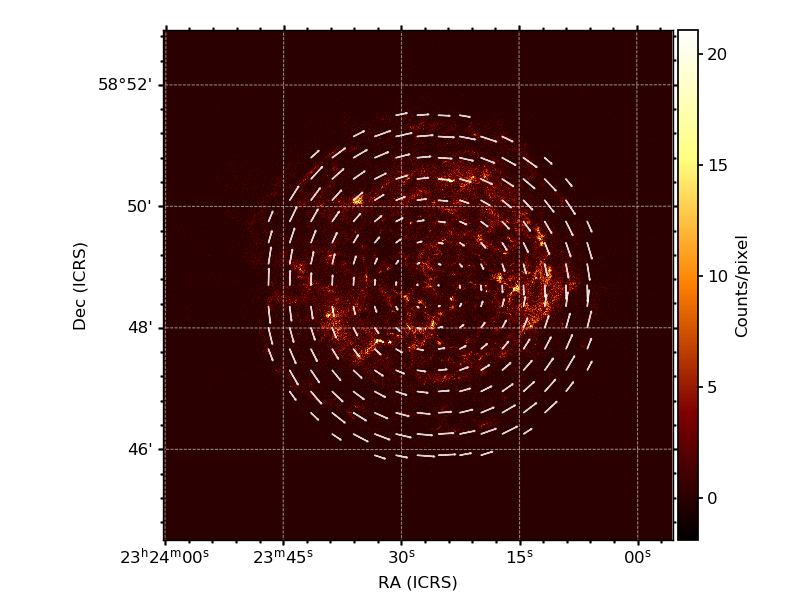
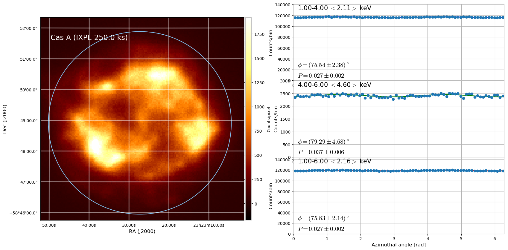
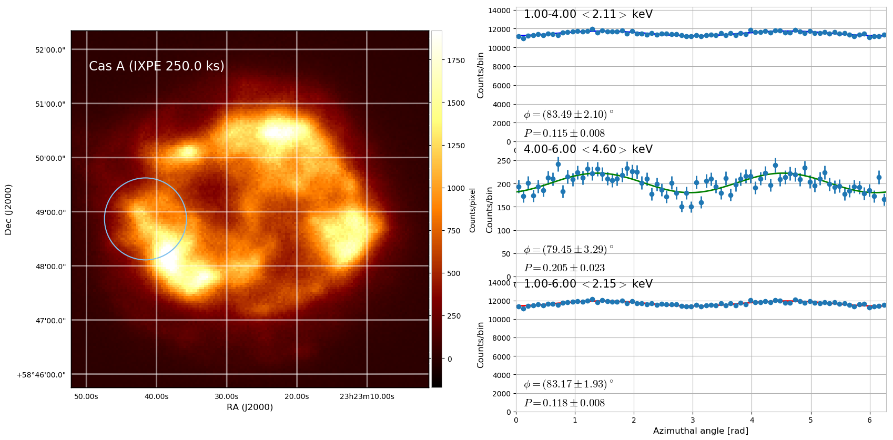
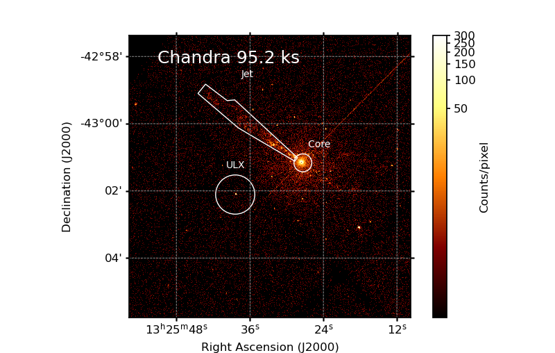
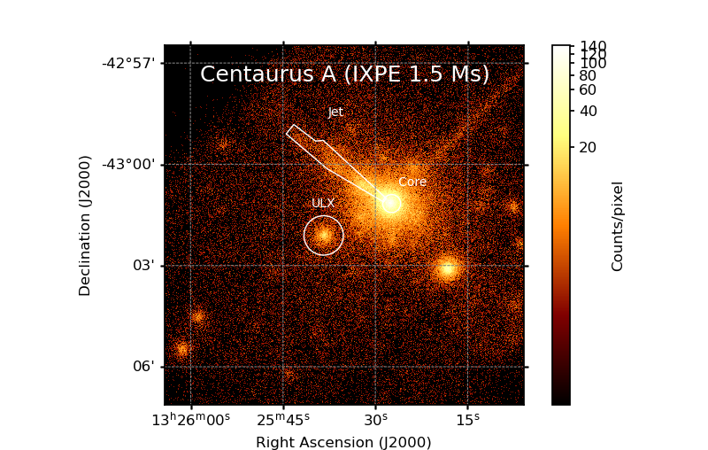

.. _showcase:

Showcase
========

NGC 1068
--------

* Source file: :repourl:`ixpeobssim/config/ngc1068.py`
* Simulation/analysis pipeline: :repourl:`ixpeobssim/examples/ngc1068.py`

.. automodule:: ixpeobssim.config.ngc1068

#Crab pulsar
#-----------
#
#* Source file: :repourl:`ixpeobssim/config/crab_pulsar.py`
#* Simulation/analysis pipeline: :repourl:`ixpeobssim/examples/crab_pulsar.py`
#
#.. automodule:: ixpeobssim.config.crab_pulsar

Cas A
-----

.. automodule:: ixpeobssim.config.toy_casa

Here is the photon spectrum we are using for the simulation of Cas A:

The morphology of the source is energy-dependent in a non trivial way.
We start from two Chandra images (in the 1.5--3 keV and 4--6 keV energy ranges,
respectively) and associate the former to the thermal spectral component and
the latter to the non-thermal one (note the absence of spectral lines between 4
and 6 keV).

.. image:: figures/models/casa_chandra_le.png
   :width: 49%

For the polarization, we assume that the thermal component is unpolarized, while
for the non-thermal component we use a simple geometrical, radially symmetric
model (loosely inspired from radio observations) where the polarization angle is
tangential and the polarization degree is zero at the center of the source and
increases toward the edges reaching about 50% on the outer rim of the source
(see figure below).

Our total model of the region of interest is therefore the superposition of two
indipendent components, with different spectral, morphological and polarimetric
properties. Crude as it is, it's a good benchmark for the observation simulator.

**Simulation output**

Below is a binned count map of a 250 ks simulated IXPE observation of Cas A,
based on the model described above. When the entire source is analyzed at once,
most of the polarization averages out and even in the high-energy band, where
the emission is predominantly non-thermal, the residual polarization degree
resulting from the averaging of the different emission regions is of the order
of 5%.

On the other hand, spatially- and energy-resolved polarimetry would in this case
reveal much of the richness in the original polarization pattern. Below is an
example of the azimuthal distributions in the two energy bands for the circular
region of interest indicated by the white circle in the left plot. For
reference, the corresponding flux integrated in the region is about 3.5% of that
of the entire source. The comparison with the previous, spatially averaged
distributions is striking.

By mapping the entire field of view with suitable regions of interest we can in
fact (at least qualitatively) recover the input polarization pattern.

Cen A
-------

* Source file: :repourl:`ixpeobssim/config/cena.py`
* Simulation/analysis pipeline: :repourl:`ixpeobssim/examples/cena.py`

Here we illustrate an example of how to convert a Chandra observation using the
xpobssim tool. The simulation concerns the Centaurus A source, based on a
Chandra event file taken from the Chandra database (for reference the
observation id is 8489). With the xpobssim tool you can also define regions
within the ROI using `regions <https://astropy-regions.readthedocs.io/en/latest/>`_.
In this example we defined the jet and core regions and the ULX star as can be
seen in the figure below.

.. automodule:: ixpeobssim.examples.cena

**Simulation output**

The plot below refers to a 1.5 Ms simulation. We selected the same three regions
to perform spatially resolved polarimetry, marked in the figure below:

For each of these regions we calculated the MDP value. In this simulation we
have also included the instrumental background and when calculating the MDP we
take these photons as the background. The results are resumed in following snippet.

.. code-block:: python

		Jet region:
		2.00--8.00 keV: 12487 src counts (99.5%) in 1.5 Ms, MDP 11.13%
		Core:
		2.00--8.00 keV: 25844 src counts (100.0%) in 1.5 Ms, MDP 6.46%
		ULX:
		2.00--8.00 keV: 4370 src counts (99.2%) in 1.5 Ms, MDP 19.24%

Instrumental background
-----------------------

The various incarnations of the instrumental background are peculiar among
source components in that the simulation happens in detector (as opposed to sky)
coordinates, and the resulting event list is not convolved with any of the
instrument response function.

The instrumental background is implemented as an instance of the
:class:`ixpeobssim.srcmodel.bkg.xInstrumentalBkg` class, or any of its
subclasses. At simulation time, the object effectively produces a uniform,
non-polarized source in the GPD reference frame.

* Source file: :repourl:`ixpeobssim/config/instrumental_bkg.py`
* Simulation/analysis pipeline: :repourl:`ixpeobssim/examples/instrumental_bkg.py`

.. automodule:: ixpeobssim.config.instrumental_bkg

.. warning::

   Care must be taken in interpreting the output of instrumental background
   simulations. While the original distribution is flat in detector coordinates,
   when the photons are looked at in sky coordinates the dithering of the
   observatory, if enabled, will produce a smearing at the edges of the field
   of view. In addition, since the default photon spectrum is fairly hard, the
   energy dispersion can cause noticeable deviations from the input power law.
