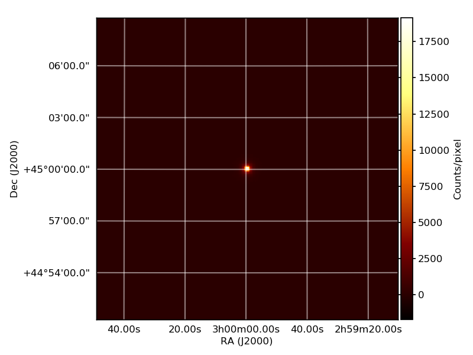
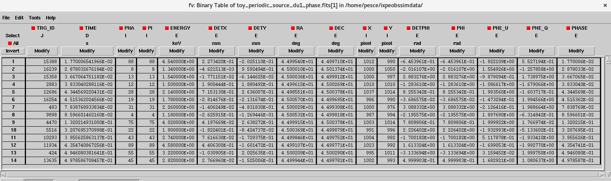

.. _tutorial:

Tutorial
========
This section is dedicated to a few tutorials on how to use ixpeobssim.

Defining a point source
-----------------------

The heart of the code lies in how we define the source that we wish to simulate
and ultimately study. In ixpeobssim we do that by writing a configuration file
in python. Several example sources can be found in the ``config`` directory, here we
will describe how to simulate a single point source with a 50 % constant
polarization degree, constant polarization angle of 30 degrees and a power-law
spectrum with index 2 and normalization of 10. Below is a snapshot of a
configuration file defining this single point source:

.. code-block:: python

   import numpy

   from ixpeobssim.config import file_path_to_model_name
   from ixpeobssim.srcmodel.roi import xPointSource, xROIModel
   from ixpeobssim.srcmodel.spectrum import power_law
   from ixpeobssim.srcmodel.polarization import constant

   # Define the source properties and create the actual source.
   ra, dec = 45., 45.
   PL_NORM = 10.
   PL_INDEX = 2.
   #Constant polarization degree and angle
   pol_deg = constant(0.5)
   pol_ang = constant(numpy.radians(30.))
   #Create the spectrum with a power-law shape with index 2 and normalization 10
   spec = power_law(PL_NORM, PL_INDEX)
   #Create the point source using the xPointSource class
   src = xPointSource('Point source', ra, dec, spec, pol_deg, pol_ang)

   # Create the complete region of interest.
   ROI_MODEL = xROIModel(ra, dec)
   ROI_MODEL.add_source(src)

We create our point source by passing our parameters (ra, dec, spectrum, ect) to
the :class:`ixpeobssim.srcmodel.roi.xPointSource` class. The first value passed
to the xPointSource class is the name of the source, in this case we simply
called it 'Point source'. You can also specify the column density (value used to
calculate the Galactic absorption) and the redshift of your source by passing it
to the class.
When running a simulation in ixpeobssim we define our region of interest (ROI)
and populate it with the sources that we wish to simulate. This is what is seen
in the above configuration file. We define the point source and then define our
ROI_MODEL by calling the :class:`ixpeobssim.srcmodel.roi.xROIModel` class.
The ra and dec values that we pass to this class define the center of the ROI.
We then proceed to add the source we just defined to the ROI. Note that we can
add any number of sources to our ROI and each source can have their own positions
(different ra and dec values than those used to define the center of the ROI).

This is all you need to create a single point source in ixpeobssim. Once you have
created your configuration file you can run a simulation of the duration you wish
as described in the :doc:`quickstart` section under the xpobssim section of the
documentation.

Defining an extended source
---------------------------

Now that we know how to define a simple point source we can move on to a more
complicated example of how to build an extended source. There are two ways to go
about doing that in ixpeobssim both of which rely on observation fits files:

* create the extended source using the :class:`ixpeobssim.srcmodel.roi.xExtendedSource` class
* create the extended source using the :class:`ixpeobssim.srcmodel.roi.xChandraObservation` class

Here we will illustrate how to use both cases.

xExtendedSource class
~~~~~~~~~~~~~~~~~~~~~
Using the :class:`ixpeobssim.srcmodel.roi.xExtendedSource` class is very similar
to what we did in the case of a single point source in the sense that we will
need to define the ROI by calling the xROIModel class and passing it the ra and
dec values for the center of your region of interest. You will also need to
provide the parameters describing the source itself (just as was done for the
point source). The major difference lies in the fact that you need to provide
an image fits file (for example a Chandra observation) that describes the
morphology of the extended source. So for example if we were to use the same
parameters used for the single point source but decide to assign them to the
morphology of CasA, then you would do the following:

.. code-block:: python

   import numpy
   import os

   from ixpeobssim.srcmodel.roi import xExtendedSource, xROIModel
   from ixpeobssim.srcmodel.polarization import constant
   from ixpeobssim.srcmodel.spectrum import power_law
   from ixpeobssim.core.spline import xInterpolatedUnivariateSplineLinear
   from ixpeobssim import IXPEOBSSIM_CONFIG

   # Define the source properties and create the actual source.
   #This is the center of the extended source (CasA)
   ra, dec = 350.8664167, 58.8117778

   #Parameters to define the power-law spectrum of the source
   #with index 2 and normalization 10
   PL_NORM = 10.
   PL_INDEX = 2.
   spec = power_law(PL_NORM, PL_INDEX)

   #Constant polarization degree and angle
   pol_deg = constant(0.5)
   pol_ang = constant(numpy.radians(30.))

   #Here is the path to the Chandra observation in the energy range 4-6 keV
   #of  CasA.
   img_file_path = os.path.join(IXPEOBSSIM_CONFIG, 'fits', 'casa_4p0_6p0_keV.fits')

   #Create the extended source calling it CasA using the xExtendedSource class
   src = xExtendedSource('CasA', img_file_path, spec, pol_deg, pol_ang)

   # Create the complete region of interest by calling the xROIModel class and
   #adding CasA to the ROI.
   ROI_MODEL = xROIModel(ra, dec)
   ROI_MODEL.add_source(src)

xChandraObservation class
~~~~~~~~~~~~~~~~~~~~~~~~~
The :class:`ixpeobssim.srcmodel.roi.xChandraObservation` class allows you to use
a Chandra photon list to describe the source that you wish to simulate,
conserving the temporal, energetic and spatial information. How this is
implemented in ixpeobssim is described in the :doc:`implementation` section.
The only parameters that you need to provide are those specifying the polarization
degree and angle and of course the observation fits file. When building a
configuration file using a Chandra photon list you need to use the
:class:`ixpeobssim.srcmodel.roi.xChandraROIModel` class instead of the
:class:`ixpeobssim.srcmodel.roi.xROIModel` class that was used in the previous
examples. It is also possible to pass a map describing the polarization degree
and angle for the extended source that you want to simulate. To do this you need
to use the :class:`ixpeobssim.srcmodel.polarization.xStokesSkyMap` class.
Here is an example of how to build a configuration file to simulate CasA using
the morphology from a Chandra observation and describing the polarization
properties with fit maps:

.. code-block:: python

   import os

   from ixpeobssim.srcmodel.roi import xChandraObservation, xChandraROIModel
   from ixpeobssim.srcmodel.polarization import xStokesSkyMap
   from ixpeobssim import IXPEOBSSIM_CONFIG

   #Path to the Chandra observation file
   chandra_evt_file_path = 'path/to/evt/file/casa.fits'

   #Here we call the xChandraROIModel class instead of the XROIModel class
   #as was done for the previous examples and we pass the path to the
   #Chandra observation file. You need to specidy the acis detector of the
   #Chandra photon list being used for the simulation.
   ROI_MODEL = xChandraROIModel(chandra_evt_file_path, acis='S')

   #Here you define the polarization degree and angle you want to assign
   #to the source. In this case the polarization map is a simple
   #geometrical, radially-symmetric, model.
   pol_mapx_path = os.path.join(IXPEOBSSIM_CONFIG, 'fits', 'casa_pmax050_reg000_x.fits')
   pol_mapy_path = os.path.join(IXPEOBSSIM_CONFIG, 'fits', 'casa_pmax050_reg000_y.fits')

   #We call the xStokesSkyMap class that handles the polarization maps.
   #The "rotate" argument is intended to deal with input maps where the
   #reference system is rotated by 90 degrees (counter-clockwise) with
   #respect to the standard system that we use throughout, i.e., with the
   #x-axis horizontal and the angles measured from the x-axis itself
   #counter clockwise. In this case the two components of the polarization
   #vector are properly swapped, i.e., x -> y and -y -> x.

   polarization_map = xStokesSkyMap.load_from_xy(pol_mapx_path, pol_mapy_path, rotate=True)

   #We define the functions for the polarization degree and angle
   def polarization_angle(E, t, ra, dec):
       return polarization_map.polarization_angle(ra, dec)

   def polarization_degree(E, t, ra, dec):
       return polarization_map.polarization_degree(ra, dec)

   #Here we create the source called CasA using the XChandraObservation
   #class and pass the name of the source, the polarization degree and
   #angle you defined above.
   casa = xChandraObservation('CasA', polarization_degree,
                              polarization_angle)

   #Add the source CasA to the ROI model
   ROI_MODEL.add_source(casa)

In this example we used a home-made map to define the polarization degree and
angle of the source. In ixpeobssim we have the capabilities of accepting maps
(in fits format) of the polarization parameters (Q/U, x/y polarization
components and polarization degree and angle) through the
:class:`ixpeobssim.srcmodel.polarization.xStokesSkyMap` class.
In this case we have created a simple model to describe the polarization as a
geometrical, radially-symmetric toy-model. Once we have created the polarization
maps, the xChandraObservation uses the spatial and spectral information of the
source from the Chandra observation and combines it with the polarization model
to build the source to simulate.

You can pass an arbitrary number of layers in different energy bands to the
:class:`ixpeobssim.srcmodel.polarization.xStokesSkyMap` class, each layer is
essentially a Stokes sky map and we interpolate the polarimetric information in
three dimensions (Ra, Dec, energy). For an example of how to implement a more
complex simulation of an extended source see the ixpeobssim/examples/tycho_3d.py
example.

Defining a periodic source
---------------------------

We have the :class:`ixpeobssim.srcmodel.roi.xPeriodicSource` class that allows
us to easily build a point-like periodic source to simulate. The basic
ingredients to describe the point source are the same as in the simple point
source configuration but this time we need to include also the information on
the ephemeris of the pulsar. The ephemeris are handled by the
:class:`ixpeobssim.srcmodel.roi.xEphemeris` class. Here is an example of how to
write a configuration file describing a pulsar with a power-law photon spectrum
with normalization that varies as a function of the pulse phase. To illustrate
the flexibility of the code, here we will also make the polarization degree vary
as a function of both energy and pulsar phase.

.. code-block:: python

   import numpy

   from ixpeobssim.config import file_path_to_model_name
   from ixpeobssim.srcmodel.roi import xPeriodicPointSource, xEphemeris, xROIModel
   from ixpeobssim.srcmodel.spectrum import power_law
   from ixpeobssim.srcmodel.polarization import constant

   ra, dec = 45., 45.

   #Method that returns a power-law normalization as a function of phase.
   def pl_norm(phase):
      """Photon spectrum: power-law normalization as a function of the pulse
      phase.
      """
      return 1.25 + numpy.cos(4 * numpy.pi * phase)

   #Constant power-law index
   pl_index = 2.
   #Use the function power_law to build the photon spectrum of the pulsar.
   spec = power_law(pl_norm, pl_index)

   #Method that returns the polarization degree as a function of energy and phase
   def pol_deg(E, phase, ra=None, dec=None):
       """Polarization degree as a function of the dynamical variables.

       Since we're dealing with a point source the sky direction (ra, dec) is
       irrelevant and, as they are not used, defaulting the corresponding arguments
       to None allows to call the function passing the energy and phase only.
       """
       norm = numpy.clip(E / 10., 0., 1.)
       return norm * (0.5 + 0.25 * numpy.cos(4 * numpy.pi * (phase - 0.25)))

   #Constant polarization angle
   pol_ang = constant(numpy.radians(30.))

   #Use the xEphemeris class to pass to the xPeriodicPointSource class
   ephemeris = xEphemeris(0., 1.)

   src = xPeriodicPointSource('Periodic source', ra, dec, spec, pol_deg, pol_ang,
   ephemeris)
   #Add the source to the ROI
   ROI_MODEL = xROIModel(ra, dec, src)

The configuration file for this particular example is included as one of the
so-called toy_models (toy_periodic_source.py) in the examples folder of the
ixpeobssim package.

Running a simulation with |xpobssim|
-------------------------------------

Running a simulation with |xpobssim| is very simple and all you really need to
provide in input is the configuration file and the duration of the simulation.
Here is the command line that you need to type (assuming that the current
working directory is the ixpeobssim root folder) to run a simulation of the
periodic source (described above) for a duration of 1000 seconds:

.. code-block:: python

   xpobssim.py --config ixpeobssim/config/toy_periodic_source.py --duration 1000

This will produce three event (FITS) files (one for each Detector Unit) in
your $IXPEOBSSIM_DATA folder.

.. warning::
   By default the energy range for the simulation is the same as the one where
   the response functions are defined (currently between 1 and 12 keV). The
   emin and emax command-line switches allow you to override the default, should
   that be needed for whatever reason (e.g., if your spectral model is only
   defined in a smaller energy range). However this feature should be used
   with caution, as some padding on both ends of the nominal 2--8 keV IXPE
   energy band is generally needed due to the energy dispersion of the detector.

Analysis tools
--------------

Once the ixpe observation-simulation has been run, ixpeobssim has a few tools to
help in the analysis/manipulation and visualization of the data. These are:

* |xpbin|
* |xpselect|
* |xpphase|
* |xpophase|

More details on these tools can be found in the :doc:`reference` section of the
documentation. For the sake of this tutorial we will go through a few examples
of how to use these tools.

The |xpbin| tool
~~~~~~~~~~~~~~~~

All the possible binning algorithms that this tool provides are described in the
:doc:`binning` and :doc:`reference` sections of the documentation. Here we will
provide a few examples on what can be done with this tool.

We will go through a few options using the output from the single point source
example provided above. Once you have the simulated data of the single point
source and you want to create a count map all you need to do is:

.. code-block:: shell

   xpbin.py $IXPEOBSSIM_DATA/single_point_source_du*.fits --algorithm CMAP

This will create your count map, and if you want to visualize your count map you
can use the |xpbinview| tool. |xpbinview| is capable of visualizing any of the
binned outputs of |xpbin| without having to specify which binning algorithm you
used.

.. code-block:: shell

   xpbinview.py $IXPEOBSSIM_DATA/single_point_source_du*_cmap.fits

And this is what you will see:

In both of the examples illustrated here, we made use of the wild card (*) to
pass all three of the event files to the tool. It is also possible to pass a
list of the event files, if you prefer.

To produce a polarization cube, all you need to do is run the |xpbin| script
specifying the ``PCUBE`` option to the algorithm argument.

.. code-block:: shell

   xpbin.py $IXPEOBSSIM_DATA/single_point_source_du*.fits --algorithm PCUBE

If you run the ``PCUBE`` algorithm the default is to bin the data in 4 energy bins.
If you would like to have an ``PCUBE`` in one single energy bin, you can specify it
via this command line option:

.. code-block:: shell

   xpbin.py $IXPEOBSSIM_DATA/single_point_source_du*.fits --algorithm PCUBE --ebins 1

The |xpbin| tool also has the ``--ebinning`` option that allows you to pass a list
containing the bin edges for the energy binning you want for your analysis.
There are several other options and binning algorithms that the |xpbin| script
can do, for a complete list all you need to do make use of the help option or
read the :doc:`reference` of the documentation.

The |xpselect| tool
~~~~~~~~~~~~~~~~~~~

As the name implies, this tool allows you to select subsets of your simulated data.
Say for example that you just simulated the MSH15-52 nebula + pulsar and that
you want to analyze the pulsar. To do that all you need to do is to run the
|xpselect| script passing the radius of the region around the pulsar and the
RA and DEC of the pulsar.

.. code-block:: shell

   xpselect.py $IXPEOBSSIM_DATA/msh1552_simulated_data_du*.fits --ra RA --dec DEC --rad radius_region

|xpselect| also has the options of selecting on energy, time, phase and source id.
This last option is for cases where you have more than one source in your ROI.

The |xpphase| tool
~~~~~~~~~~~~~~~~~~

This particular tool is needed when you are simulating periodic sources, in
particular |xpphase| creates an extra column in the event file for the
phase of the periodic source. All this tool needs is the file list (output from
the simulation) and the configuration file used to run the simulation.

.. warning::
  The following is obsolete and must be edited.

.. code-block:: shell

   xpphase.py $IXPEOBSSIM_DATA/toy_periodic_source_du*.fits --config ixpeobssim/config/toy_periodic_source.py

This will create three new fits files in your ``$IXPEOBSSIM_DATA`` directory that
are the same as the output of the simulation but now with an extra column for
the phase of the pulsar. The name of the output fits files will be the same as
the input but with an added suffix 'phase'. You can also specify the suffix for
the output files by including the ``--suffix`` option when running |xpophase|.
Below is a snapshot of the fits file columns after running the above command.

The |xpophase| tool
~~~~~~~~~~~~~~~~~~~

 .. warning::
   This section is searching for a writer :-)

Analysis pipelines
------------------

Each ixpeobssim application is wrapped in the :mod:`ixpeobssim.core.pipeline`
module so that it can be called from within a generic Python script with the
exact same arguments that one would pass from command line. Several examples of
how to do this are described in the :ref:`pipeline`  section of the ixpeobssim
documentation. There are also several Python scripts in the example folder of
the ixpeobssim package that illustrate how to perform a full analysis chain
using the pipeline facility.
